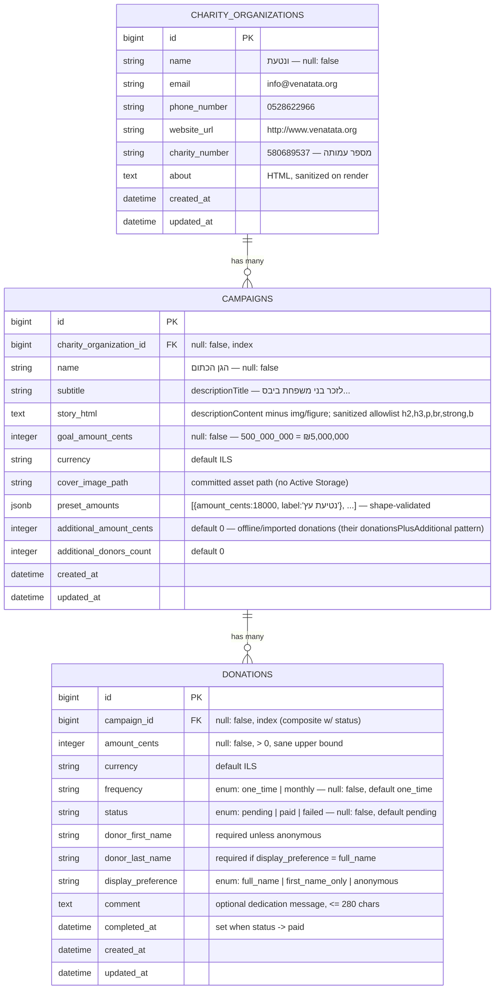

# ERD — JGive Campaign Donation Page

Planned schema (3 tables). Mirrors JGive's real domain (`DonationTarget` /
`RecentDonation` / `CharityOrganization` from their GraphQL) at take-home scale.

## Indexes

| Table | Index | Why |
|---|---|---|
| campaigns | `charity_organization_id` | FK lookup |
| donations | `(campaign_id, status)` composite | the `countable` aggregate (`SUM`/`COUNT` filtered by status) — the hottest query |
| donations | `created_at` | recent-donations list ordering (`recent_first`) |

## Enums (string-backed, Rails 8 `enum`, validated)

| Column | Values | Notes |
|---|---|---|
| `donations.frequency` | `one_time` (default) / `monthly` | the form's תרומה חד-פעמית / הוראת קבע; billing mechanics out of scope |
| `donations.status` | `pending` (default) / `paid` / `failed` | form submit ⇒ `pending`; payment webhook would flip to `paid` + set `completed_at` |
| `donations.display_preference` | `full_name` / `first_name_only` / `anonymous` | assignment's three options (site's differ — deliberate divergence, see plans.md §2) |

## Derived values (computed, never stored)

| Value | Formula |
|---|---|
| `raised_cents` | `additional_amount_cents + SUM(donations.amount_cents WHERE status IN (pending, paid))` |
| `donors_count` | `additional_donors_count + COUNT(same scope)` |
| `progress_percent` | `raised_cents * 100.0 / goal_amount_cents` (0 when goal is 0) |

One DB round-trip via `pick(SUM, COUNT)`, memoized per request (`Campaign#stats`).
**Policy:** `pending` counts toward progress (assignment: submit must update progress) —
isolated in the `Donation.countable` scope; switching to paid-only is a one-word change.

Donor display name is also derived (`Donation#display_name`): `full_name` → "first last",
`first_name_only` → first, `anonymous`/blank → nil ⇒ rendered as "תורם/ת אנונימי/ת"
(mirrors JGive's `name: null` pattern).

## Mapping to JGive's real GraphQL schema

| Theirs (GraphQL) | Ours | Note |
|---|---|---|
| `DonationTarget` | `Campaign` | routes Rails-conventional: `/campaigns/:id` (user pref: convention over their custom path) |
| `.name` / `.descriptionTitle` / `.descriptionContent` | `name` / `subtitle` / `story_html` | |
| `.goalProperty.amount` (5,000,000) | `goal_amount_cents` | we store cents |
| `.donationTargetSummary.totalAmount` | derived `raised_cents` | they denormalize; we compute |
| `.donationTargetSummary.donationsPlusAdditionalDonationsCount` | derived `donors_count` (+ `additional_donors_count`) | same "additional" idea |
| `.featureSet.purposes` (preset cards) | `preset_amounts` jsonb | no separate table at this size |
| `RecentDonation.amountCents/.amountCurrency` | `amount_cents` / `currency` | identical convention |
| `RecentDonation.name: null` | derived `display_name` ⇒ nil | anonymous |
| `RecentDonation.comment` | `comment` | the assignment's "dedication message" |
| `RecentDonation.recurring` | `frequency` | enum instead of boolean (extensible) |
| `RecentDonation.completedAt` | `completed_at` | |
| `CharityOrganization` (id 2602) | `CharityOrganization` | name/email/phone/url/charity_number/about |

## Why no `donors` table?

Deliberate. (1) The assignment puts **accounts/login out of scope**, and without login or
a collected email there is **no identity key to dedupe on** — every donation would mint a
fresh donor row: a 1:1 JOIN carrying no information. (2) What the page shows is a
**per-donation snapshot** (name + display preference + comment as chosen *at donation
time*) — that belongs on `donations` even in systems with accounts, so history doesn't
rewrite itself when a donor renames. (3) JGive's own public `RecentDonation` does the
same: it carries `name` directly (nullable). (4) Clean upgrade path when accounts arrive:
`donors(email unique)` + nullable `donations.donor_id` FK, backfill by email, keep the
name fields as the historical snapshot — nothing built now is thrown away.

## Deliberately NOT modeled (scope cuts — plans.md §10)

Users/accounts, teams/groups, ambassadors, campaign updates, matching settings,
feature-set/visual-property tables (their CMS-style toggles — ours are code),
multi-currency rates, hidden-amount privacy axis, heart counts, payments/charges.
